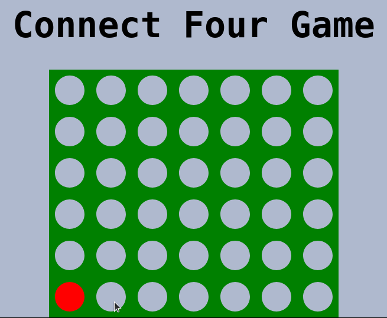

# connect-four

[Play Here!](https://m-sette.github.io/connect-four/ "connect-four Game")

To win Connect Four you must be the first player to get four of your colored checkers in a row either horizontally, vertically or diagonally.

